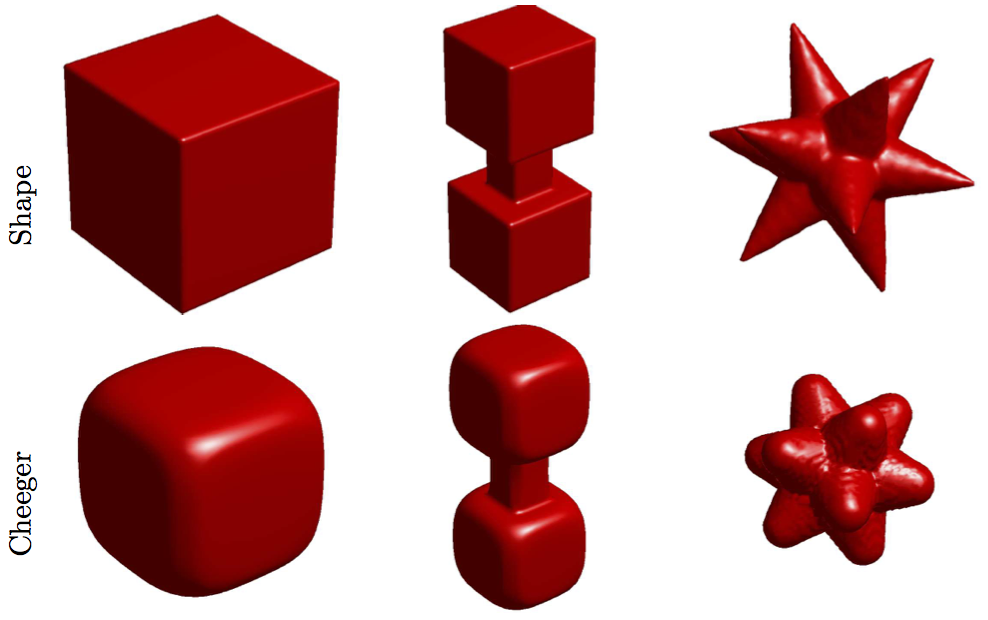

This Matlab package contains the source code to reproduce the figure of the article:

G. Carlier, M. Comte, G. Peyré. [Approximation of Maximal Cheeger Sets by Projection](https://hal.archives-ouvertes.fr/hal-00359736). ESAIM: Mathematical Modelling and Numerical Analysis, 43(1), pp. 131–150, 2009.

Copyright (c) 2009 abriel Peyré
